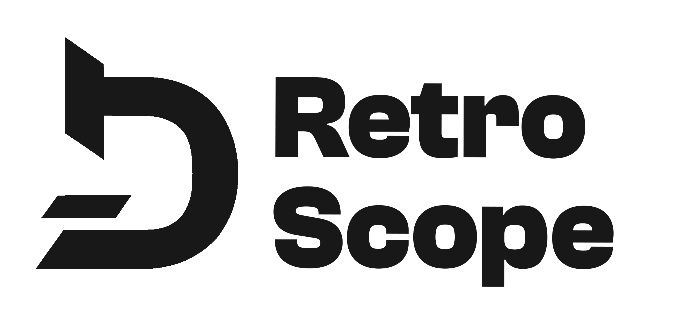
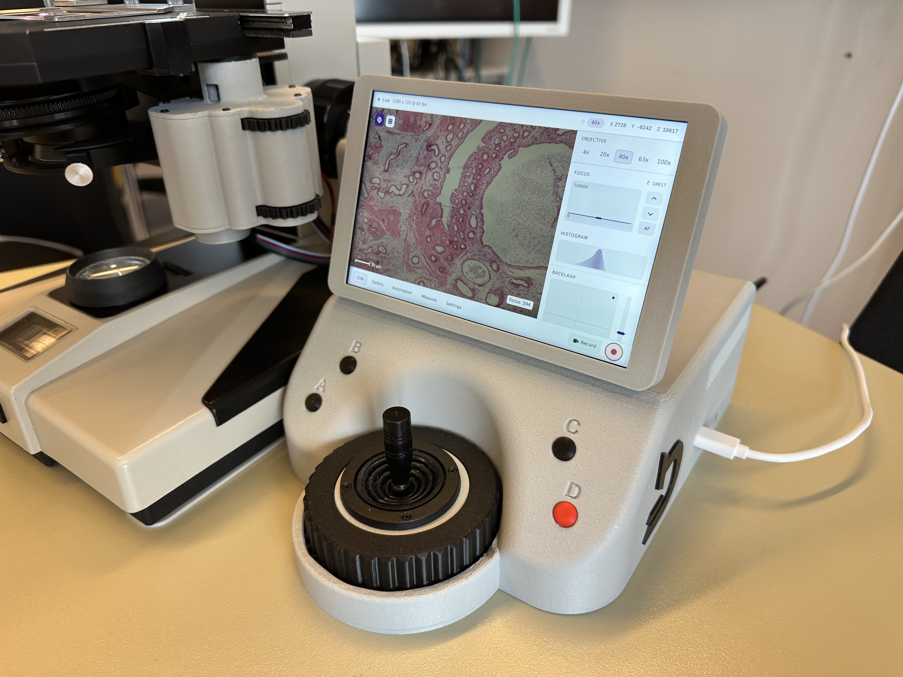
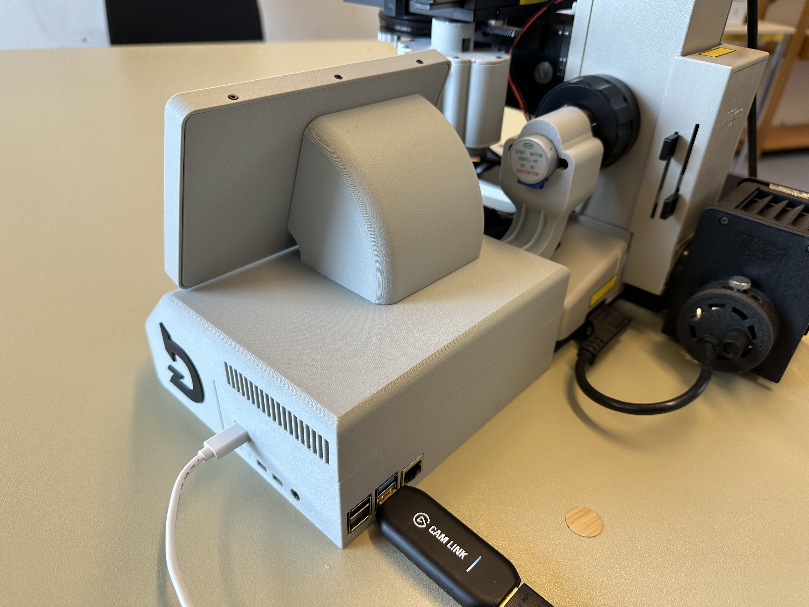
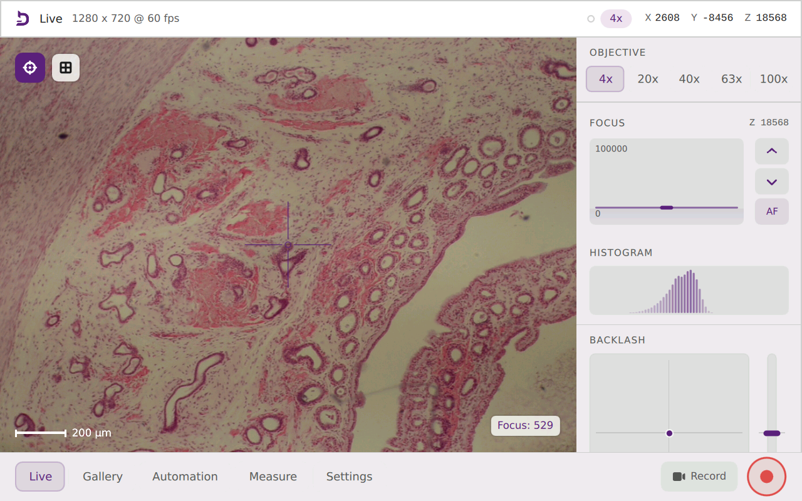
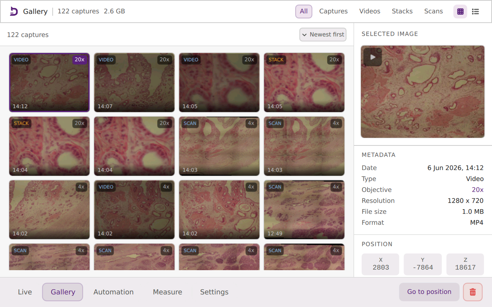
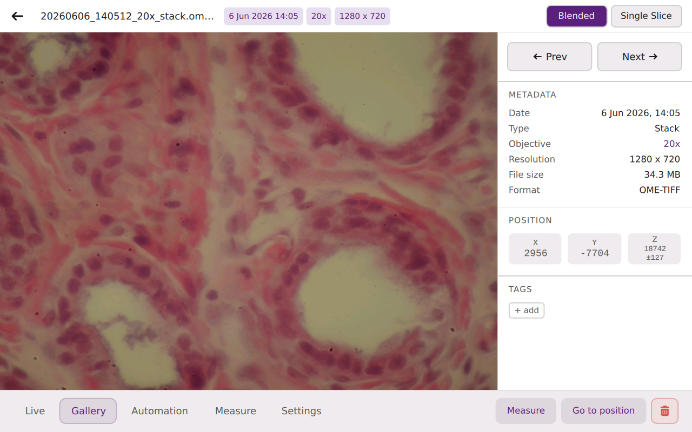
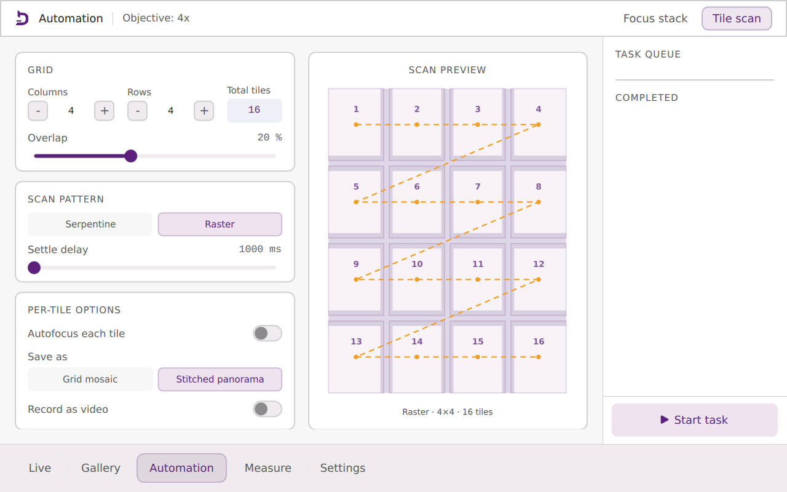
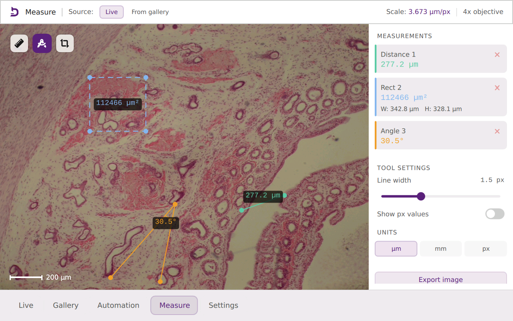
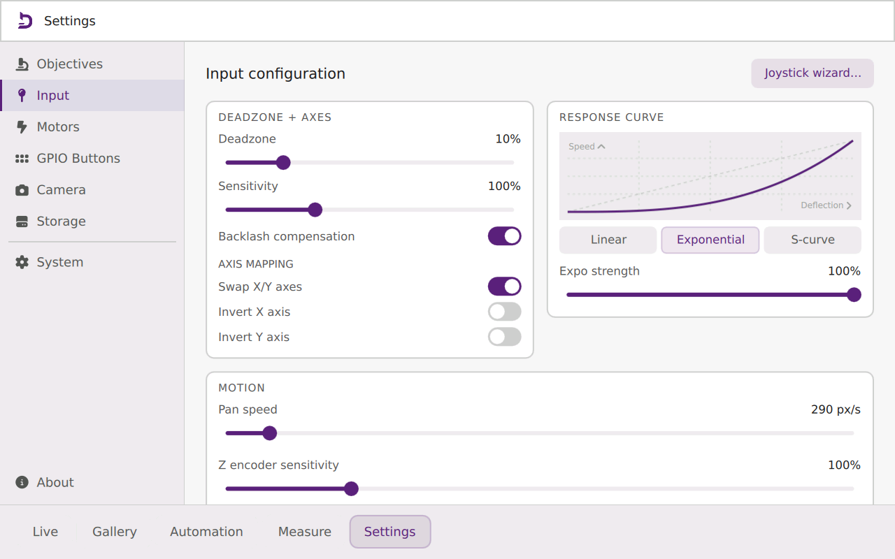

<picture>
  <source media="(prefers-color-scheme: dark)" srcset="retroscope/qml/icons/app_logo_dark.png">
  <source media="(prefers-color-scheme: light)" srcset="retroscope/qml/icons/app_logo_light.png">
  
</picture>

---

**An Open Platform for Motorizing and Digitizing Vintage Microscopes**

RetroScope is an open-source platform for older analog microscopes. It combines software, digital imaging, motorized stage and focus control, calibration workflows, and adaptable mechanical parts so that existing microscopes can be upgraded instead of replaced.

<p align="center">
  
  
</p>

The project was developed as part of the master's thesis **"Retrofitting a Vintage Microscope: Development of an Embedded System for Motorized Control and Digital Imaging"** in Applied Computer Science at Flensburg University of Applied Sciences.

## Overview

RetroScope is not just a single application. It is intended as a complete retrofit platform:

- **Control software**: Python/PySide6 backend with a QML touchscreen interface.
- **Embedded system**: Raspberry Pi-based embedded system with mock/development support for desktop.
- **Motor control**: XY stage and Z focus movement through a motor controller ([Sangaboard](https://build.openflexure.org/openflexure-microscope/v7.0.0-beta5/parts/electronics/sangaboard.html)).
- **Digital imaging**: Live camera preview, snapshots, video recording, OME-TIFF support and gallery management.
- **Automation**: Autofocus, focus stacking and tile scanning with stitching support.
- **REST API**: FastAPI with Swagger/OpenAPI documentation for e.g. external tools.
- **Calibration**: Calibration wizards with objective profiles, pixel scale, stage scale, backlash compensation, etc.
- **Electronics**: PCB schematics and Gerber files for manufacturing. Optional, just used to reduce the amount of cabling.
- **Mechanical design**: Parametric Fusion/CAD files and 3D-printable parts for adapting the retrofit to different microscopes.

## Features

- Low-latency live microscope view with overlays such as crosshair, scale bar and grid.
- Objective profile system for different magnifications and numerical apertures.
- Camera-assisted calibration for image scale, stage scale, and backlash compensation
- Manual stage and focus control through touchscreen, joystick, and configurable buttons.
- Contract-based autofocus.
- Automated focus stacks and tile scans.
- Measurement tools for distances, rectangles and angles.
- Gallery for snapshots, videos, focus stacks, scans, and tagging.
- REST API to access captures and trigger actions like autofocus.
- Configurable dark/light UI
- Mock mode for development without microscope hardware.

## Screenshots

<p align="center">
  
  
  
  
  
  
</p>

## Software Architecture

The software is organized into modular layers:

- `retroscope/drivers`: Low-level hardware drivers for camera input, Sangaboard motor control, joystick ADC, buttons, and endstop.
- `retroscope/services`: Application logic for motion, autofocus, calibration, camera processing, tile scanning, focus stacking, updates, ...
- `retroscope/api`: FastAPI REST interface and OpenAPI/Swagger documentation.
- `retroscope/domain`: Pure domain modules (+ calculations) for scan planning, focus metrics, objective calibration, measurement, ...
- `retroscope/bridge`: Qt/PySide bridge objects that expose APIs to QML.
- `retroscope/qml`: Touchscreen user interface components and views.
- `tests`: Unit tests for calibration, autofocus, motion, scanning, settings, ...

This separation enables the expansion of individual subsystems without rewriting the entire platform.

## Hardware Recommendations

The following parts were used for the prototype:

- Raspberry Pi 4 Model B, 4 GB RAM
- [Sangaboard](https://build.openflexure.org/openflexure-microscope/v7.0.0-beta5/parts/electronics/sangaboard.html)
- 3x 28BYJ-48 Stepper Motors
- DSI Capacitive Touch Display
- Analog Joystick with 10k Potentiometers
- ADS1115 ADC Modul
- Incremental Rotary Encoder
- Bearing (60mm * 78mm * 10mm)
- Endstop
- 4x Buttons
- Various cables
- ABS (& PETG) filament/s for 3D printed parts
- Optional Custom PCB

## Installation

Clone the repository and create a virtual environment:

```bash
git clone https://github.com/marvincarstensen/RetroScope.git
cd retroscope
python[3] -m venv .venv
source .venv/bin/activate
pip install -r requirements.txt
```

For Raspberry Pi deployment, an additional setup script, to e.g. setup the service, has to be run with sudo:
```bash
sudo bash deploy/setup.sh
```

## Running

Start the application:

```bash
python app.py
```
> [!NOTE]
> First launch may take a little longer while Python builds its caches.

Run in mock mode for desktop env:

```bash
python app.py --mock
```

Enable development mode with QML hot reloading:

```bash
python app.py --mock --dev
```

Apply a UI scale factor:

```bash
python app.py --scale 1.5
```

On the Raspberry Pi with Wayland:

```bash
WAYLAND_DISPLAY=wayland-0 XDG_RUNTIME_DIR=/run/user/1000 python app.py --scale=1.5
```

## Testing

Run the test suite:

```bash
.venv/bin/python -m pytest -q
```

Compile-check on the package:

```bash
.venv/bin/python -m compileall -q retroscope
```

Run QML lint checks:

```bash
.venv/bin/pyside6-qmllint -I retroscope/qml $(find retroscope/qml -name '*.qml')
```

## Evaluation

The evaluations run inside the main application so they use the real camera pipeline, motion
services, calibration state, and workflow services. Results are written as CSV files to
`evaluation_output/`, with per-trial rows followed by summary rows. Needs a textured specimen and a safe stage position to run properly. The active objective needs to be selected and calibrated before running measurements.

Available evaluation types:

- `motion_accuracy`: compares commanded X/Y movement with measured image displacement and backlash residuals.
- `stage_scale`: measures repeated stage-scale estimates in micrometres per motor step.
- `calibration_repeat`: repeats stage-scale and backlash checks for the active objective.
- `workflow_reliability`: runs autofocus, focus stacking, and tile scanning through the app services.

Example runs:

```bash
python app.py --eval motion_accuracy --eval-arg axes=xy --eval-arg steps=100,200 --eval-arg reps=10
python app.py --eval stage_scale --eval-arg steps=100 --eval-arg reps=10
python app.py --eval calibration_repeat --eval-arg stage_steps=200 --eval-arg reps=10
python app.py --eval workflow_reliability --eval-arg reps=10 --eval-arg workflows=autofocus,focus_stacking,tile_scanning
```

## REST API

By default, the API is enabled and listens on port `8765`:

- `http://127.0.0.1:8765` / `http://<device-ip>:8765`
- Swagger UI: `http://<device-ip>:8765/docs`
- OpenAPI JSON: `http://<device-ip>:8765/openapi.json`

The current API is intentionally small and intended as an extension point for scripts, notebooks, and external tools.

Endpoint                                  | Description
------------------------------------------|-------------------------------
`GET /api/v1/health`                      | API health check.
`GET /api/v1/captures`                    | List gallery captures.
`GET /api/v1/captures/{id}/download`      | Download the original capture file.
`POST /api/v1/actions/autofocus`          | Start autofocus.
`POST /api/v1/actions/capture`            | Start capture.

## Demo Notebook

The repository contains a basic Jupyter notebook, `retroscope_api_demo.ipynb`, that demonstrates how to use the REST API.

## Shortcuts (Mock only)

The following keyboard shortcuts can be used in mock simulation:

Key       | Function           
----------|-------------------
WASD      | Joystick axes        
Space     | Joystick center (release)         
+/-       | Encoder step +-1       
1/2/3/4   | Button press 0–3      
E         | Simulate endstop triggered/released toggle

## Dependencies

The following plugins, libraries and frameworks are used:

Name                    | Version           
------------------------|-------------------
PySide6                 | 6.11.1
fastapi                 | 0.136.3
httpx2                  | 2.3.0
uvicorn                 | 0.49.0
numpy                   | 2.4.6
pytest                  | 9.0.3
opencv-python-headless  | 4.13.0.92
Pillow                  | 12.2.0
tifffile                | 2026.5.15
sangaboard              | 0.3.3
smbus2 (only on Pi)     | 0.6.1           
gpiod (only on Pi)      | 2.4.2   

## Additional Sources

- Font Awesome by Dave Gandy (https://fontawesome.com/)
- LateX Template, Logo & CI (DeepMicroscopy) by Nils Porsche (@XYZ)

ToDo: Add all references

## Declaration: Use of Generative AI

The following generative AI tools were used in this thesis: 

- GitHub Copilot in VS Code was used for inline code-completion suggestions during implementation and writing.
- ChatGPT (OpenAI) & Claude (Anthropic) used to support brainstorming, quick research, and the generation of selected parts of the code (e.g. unit tests). AI-assisted scripts and functions are marked in the source code via comments.
- DeepL write (DeepL SE))were used in language editing and grammatical proof-reading.

All AI-generated material was critically reviewed, edited, and verified by the author. No generative AI system was used to produce original scientific results, experimental data, proofs, or final implementations of algorithms. The author assumes full responsibility for the content, correctness, and originality of this thesis.
