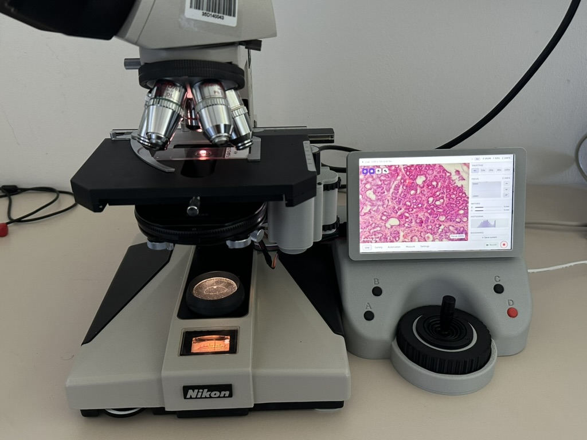

<picture>
  <source media="(prefers-color-scheme: dark)" srcset="retroscope/qml/icons/app_logo_dark.png">
  <source media="(prefers-color-scheme: light)" srcset="retroscope/qml/icons/app_logo_light.png">
  
</picture>

# RetroScope

**An Open Platform for Motorizing and Digitizing Vintage Microscopes**

RetroScope is an open-source platform for older analog microscopes. It combines software, digital imaging, motorized stage and focus control, calibration workflows, and adaptable mechanical parts so that existing microscopes can be upgraded instead of replaced.

**TODO: Replace image:**

  

The project was developed as part of the master's thesis **"Retrofitting a Vintage Microscope: Development of an Embedded System for Motorized Control and Digital Imaging"** in Applied Computer Science at Flensburg University of Applied Sciences.